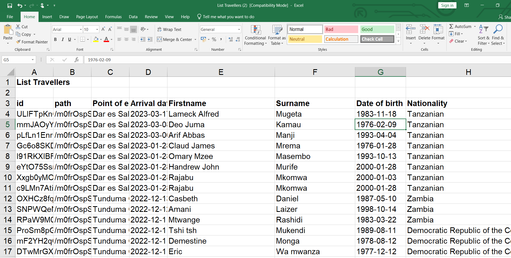
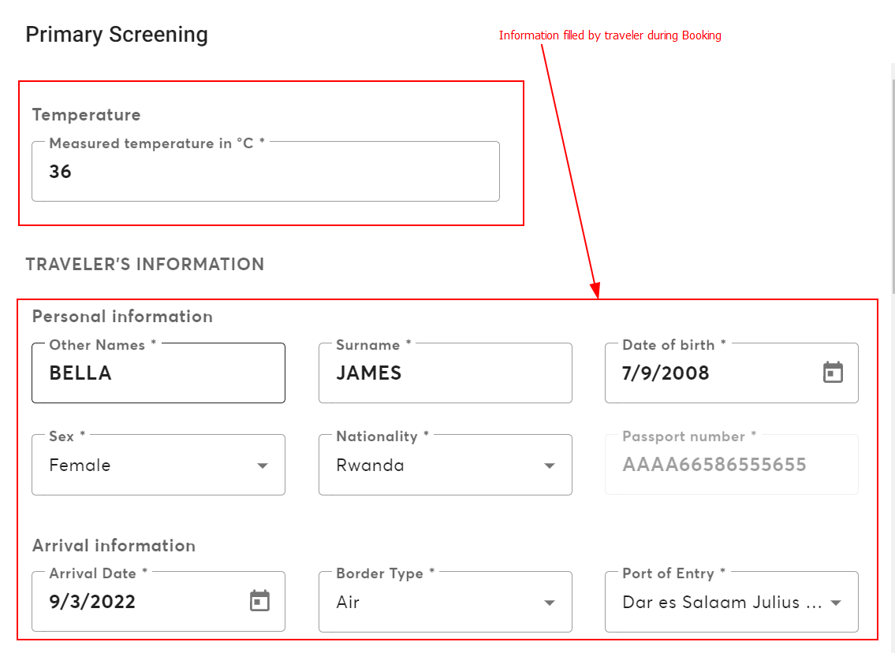
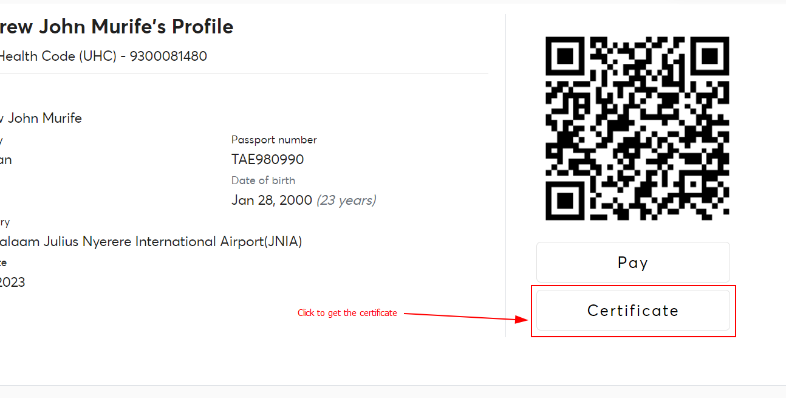
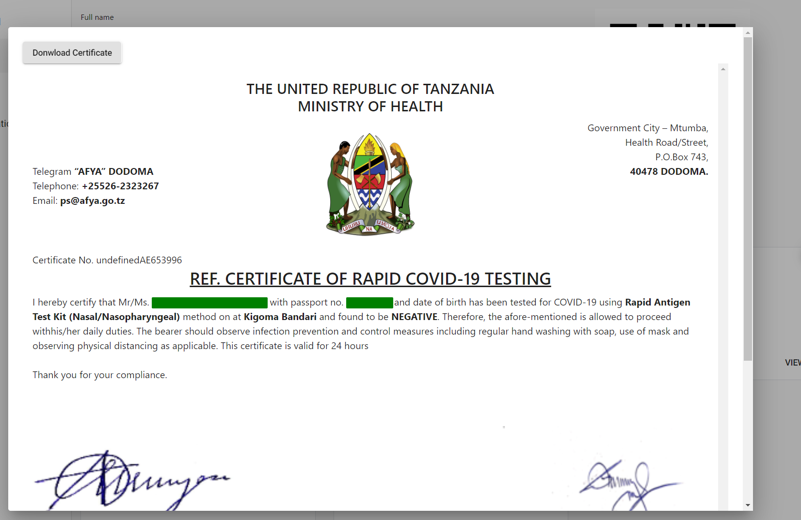
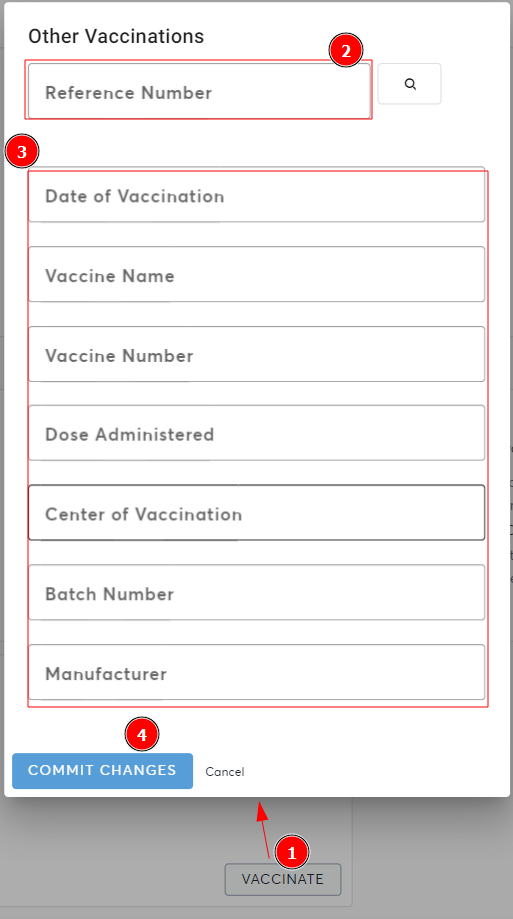

PART FOUR - AFYA MSAFIRI SYSTEM FOR MANAGERS
The afyamsafiri system for managers is used by port health officers (PHOs) to perform surveillance activities at the point of entry. They are responsible for screening all travelers who enter or leave the country. Port Health Officers record travelers screening information, vaccination information together with provision of certificates and implementation reports (daily and weekly). To access the system  use the following link https://afyamsafiri-admin.moh.go.tz.

 
Figure 24: Manager login screen

4.1.	Accessing afyamsafiri application
A Port Health Officer must have link to the system and a computing device connected to the internet and follow these steps:

Step 1	Open a web browser
Step 2	Type the Url (https://afyamsafiri.moh.go.tz/) on your browser address bar.
Step 3:	Enter username and password
Step 3	Select the afyamsafiri application from the application manager or from the search tab as shown in figure 4.1
Step 4	Click the application to access afyamsafiri features and functionalities.

 
Figure 4.1: Screen shot of afyamsafiri application

 
Figure 4.2: Landing Page for manager – Replace with the arrival dashboard

List of travelers 
When you are at the arrival page you will see today's highlights:  which show the number of expected travelers, number of primary screened travelers, number of Secondary screened travelers, number of samples collected and number of tested (Figure 4.2a). When you are at the departure page you will only see the todays highlights and list of travelers booked for screening (Figure: 4.2b)

 

Figure 4.2a: Todays’ highlight on arrival and departure

 
Figure 4.2b: Displayed list of travelers

Traveler Filtering
With filters you will be able to easily access the desired travelers’ information. These will allow you to access travelers in groups e.g. by nationality or just specific e.g. Using passport (Figure 4.2c). Click the download button to get the list of travelers in excel (Figure 4.2.d).

 
Figure 4.2c: Different filters that can be used to access travelers’ information

 
Figure 4.2d: List of travelers

4.2.	Screening of travelers
Select activity to be undertaken starting with Primary Screening, Secondary Screening, Sample collection and Provide results (figure …)
 
Figure 4.2e: Screening steps that a traveler may pass through 

4.2.1.	Primary Screening
This process involves physical observation and passing through the details that were submitted by the traveler during booking. 
Step 1:		Filter and click the traveler to be screened (refer Sect ...)
Step 2;	Verify traveler’s information and record the temperature readings by clicking “screen now” button. 
Step 3:	Make decision; either subject to secondary screening or allow to proceed with travel based on the physical observation and travelers’ information in the system

 
 
Figure 4.2.1: Primary screening process for travellers and decision to be made. 

4.2.2.	Secondary Screening
This process involves responding to risk exposure questions which can be whether Yes, No or Unknown. The following step should be followed by Port Health Officers attending travelers. 

Step 1:	Filter and click the traveler to be screened (refer Sect ...)
Step 2:	Select “screen now” option on the secondary screening card.
Step 3:	Interview the traveler and record risk exposure details in the system
Step 4: 	Make a decision; either allow to proceed with Exit/Entry formalities, or allow to proceed with Exit/Entry formalities under condition, or Delay Travel, or Deny travel based on the traveler's responses (see figure …)
Step 5:	Submit the information by clicking the “commit changes” button. 

 

 
Figure 4.2.2a: Secondary screening form

4.2.3.	Sample collection
In Case there is a need for sample collection follow the following steps

Step 1:	Filter and click the name of traveler to be attended (refer Sect ...)
Step 2:	Verify payment by clicking the check payment card. If the button is disabled, verify if the traveler has paid by checking the payment status on the check payment card. If the control number is not set, click the “resend bill” button to generate the control number and direct the traveller to pay for the service.
		
Add screen shot

Step 3:	Click the “collect now” option on the sample collection card. 
		
Step 4	Click to fill all fields in the pop-up window: date of sample collection, lab number, type of specimen and type of test (Figure 4.2.2b)

Step 5: 	Click “commit changes” button to submit the information and proceed to provide results.

 
Figure 4.2.2b: Recording sample details

4.2.4.	Record results and provide certificates

Step 1: 	Filter and click the name of traveler to be attended (refer Sect ...)
Step 2:	Click the “record now” option on the provide result card.
Step 3	Click to fill the test results to the system

 
Figure 4.2.2.c: Filling in Test results

Step 4:	Click “commit changes” button to submit test results
 Add screen shot – commit changes

Step 5: 	Click “Certificate” button at the right side of screen to access the certificate.

 
Figure: getting the certificate for test result

 
Figure: Certificate generated based on the test details that were recor

Step 6: 	Click “download certificate” to save as PDF or print.    
4.3.	Yellow Fever Vaccination and Certificate
Step 1:	Open a web browser
Step 2: 	Type the Url (https://afyamsafiri-admin.moh.go.tz/) on your browser.
Step 3: 	Enter username and password and click “sign in”
Step 4:	Select the afyamsafiri manager from the application manager or from the search tab as shown in figure 4.1. 
Step 5:	Click “Yellow fever” from the left side bar of the dashboard
Step 6: 	Filter and click the name of client to be attended (refer Sect ...). 
Step 7:	Review client’s profile to verify the filled information and edit by clicking the “edit” icon if required.
Step 8:		Click “assess now” for clinical assesment
Step 9:	Click to fill all fields in the pop-up window about clinical assesment (Figure 4.2.2b). 

NB: In case of “YES” response in the clinical assesment, the vaccination panel will not appear.
Step 10: 	Click “commit changes” button to save the information.
Step 11:	Click “vaccinate” on the vaccination panel for vaccination 
Step 12:	Click to fill all fields in the pop-up window about the vaccine (Figure 4.2.2b). 
Step 13: 	Click “commit changes” to save the information.
Step 11:	Click “vaccinate” on other vaccination panel to include other vaccination 
Step 13:	Click to enter COVID 19 reference number to acquire COVID 19 vaccination details from CHANJOCOVID System (Figure 4.2.2b). 
Step 14: 	Click “commit changes” to save the information.
Step 15:	Click “view certificate” at the right side of screen to access the certificate.
Step 16: 	Click “download certificate” to save as PDF or print.   

In case of exemption certificate,

Step 1:		Click “assess now” for clinical assesment
Step 2:	Click to fill all fields in the pop-up window about clinical assesment (Figure 4.2.2b). 
Step 3: 	Click “commit changes to save the information.
Step 4:	Click “vaccinate” on other vaccination panel to include other vaccination 
Step 5:	Click to enter COVID 19 reference number to acquire COVID 19 vaccination details from CHANJOCOVID System (Figure 4.2.2b). 
Step 6: 	Click “commit changes” to save the information.
Step 7:	Click “view certificate” at the right side of screen to access the certificate.
Step 8: 	Click “download certificate” to save as PDF or print.   

In case of booking has not been made by client,

Step 1:	Open a web browser
Step 2: 	Type the Url (https://afyamsafiri-admin.moh.go.tz/) on your browser.
Step 3: 	Enter username and password and click “sign in”
Step 4:	Select the afyamsafiri manager from the application manager or from the search tab as shown in figure 4.1. 
Step 5:	Click “Yellow fever” from the left side bar of the dashboard
Step 6:	Click “add Yellow Fever” to open yellow fever booking form.
Step 7:	Enter passport number or ID and click search
Step 8:	Click to fill all fields in the yellow fever vaccination form on demographic information and clinical information.
Step 9: 	Click “submit” to save the information.
 Figure: Form for filling in details for yellow fever booking placing a book.
NB:	If the “submit button” is not active – review the responses and ensure all the required fields marked with asterisk sign (*) are completed.

Step 10: 	Click ( ) in the declaration note and then click “complete” to save the details.

NB: Filled details will be saved only when they see form completion notice, If you click “close” the information will be lost.

 
Figure 3.2.5: Screen shot of traveler’s form completion notice (add instruction tick here)
Screen shot: Form completion notice and information page (click here to edit)

4.4.	Card replacement
Step 1:	Open a web browser
Step 2: 	Type the Url (https://afyamsafiri-admin.moh.go.tz/) on your browser.
Step 3: 	Enter username and password and click “sign in”
Step 4:	Select the afyamsafiri manager from the application manager or from the search tab as shown in figure 4.1. 
Step 5:	Click “card placement” from the left side bar of the dashboard
Step 6: 	Filter and click the name of client to be attended (refer Sect ...). 

 

 
Figure 4.3a : Selecting yellow fever menu to attend a client who booked for vaccination

 
Step 2: 	Select client from the list  by clicking ellipsis button (“...”) for the desired client (Figure 4.3b)

 
Figure 4.3b: accessing a client from the list

Step 3: 	Verify clinical assessment details as was filled by the client during booking. Make necessary changes if required (Figure 4.3c)

 
Figure 4.3c:clinical assessment questions

Step 4:	Fill in the details about the vaccine given to the client which includes date of vaccination, vaccine batch number,professional status of the vaccinator, vaccine manufacture and the validity of the vaccine (Figure 4.3d). Once done  you will submit the information by clicking the “commit changes” button in which system will generate the international certificate of vaccination or prophylaxis (ICVP).

 
Figure4.3e: Filling in vaccination information
Step 5: 	Generate the certificate by clicking the “View certificate” button seen on the right of the screen. The certificate contains details about the client including names, passport or travel document number, date of issue and clients signature.

Step 6: 	Print the vaccination card and provide it to the client after confirmation of payments has been done

 	 static/img/3F.png
Figure 4.3f: opening certificate

NB: Other Vaccination information
To add other vaccination information to the generated ICVP go through the following steps

Step 1:	Click the “vaccinate ” button to open the view containing the details for other vaccination
Step 2:	Search vaccination information using IVD reference number
Step 3: 	Verify the details that will be pre-filled if they are valid for the client who requested for ICVP
Step 4: 	Save the information so that it is attached to the ICVP

 
Figure 4.3G: form for
