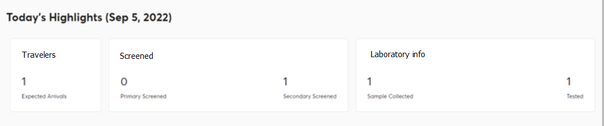

## PART FOUR - AFYA MSAFIRI SYSTEM FOR MANAGERS

The afyamsafiri system for managers is used by port health officers (PHOs) to perform surveillance activities at the point of entry. They are responsible for screening all travelers who enter or leave the country. Port Health Officers record travelers' screening information, vaccination information, and provide certificates and implementation reports (daily and weekly). To access the system use the following link [https://afyamsafiri-admin.moh.go.tz](https://afyamsafiri-admin.moh.go.tz).

**Figure 24:** Manager login screen

### 4.1. Accessing afyamsafiri application

A Port Health Officer must have the link to the system and a computing device connected to the internet and follow these steps:

1. Open a web browser.
2. Type the URL [https://afyamsafiri.moh.go.tz/](https://afyamsafiri.moh.go.tz/) on your browser address bar.
3. Enter username and password.
4. Select the afyamsafiri application from the application manager or from the search tab as shown in Figure 4.1.
5. Click the application to access afyamsafiri features and functionalities.

**Figure 4.1:** Screenshot of afyamsafiri application

**Figure 4.2:** Landing Page for manager – Replace with the arrival dashboard

**List of travelers**

When you are at the arrival page you will see today's highlights: which show the number of expected travelers, number of primary screened travelers, number of secondary screened travelers, number of samples collected, and number of tested (Figure 4.2a). When you are at the departure page, you will only see today's highlights and the list of travelers booked for screening (Figure 4.2b).

**Figure 4.2a:** Today's highlights on arrival and departure

**Figure 4.2b:** Displayed list of travelers

**Traveler Filtering**

With filters, you will be able to easily access the desired travelers’ information. These will allow you to access travelers in groups, e.g., by nationality or just specific, e.g., using passport (Figure 4.2c). Click the download button to get the list of travelers in Excel (Figure 4.2d).

**Figure 4.2c:** Different filters that can be used to access travelers’ information

**Figure 4.2d:** List of travelers
