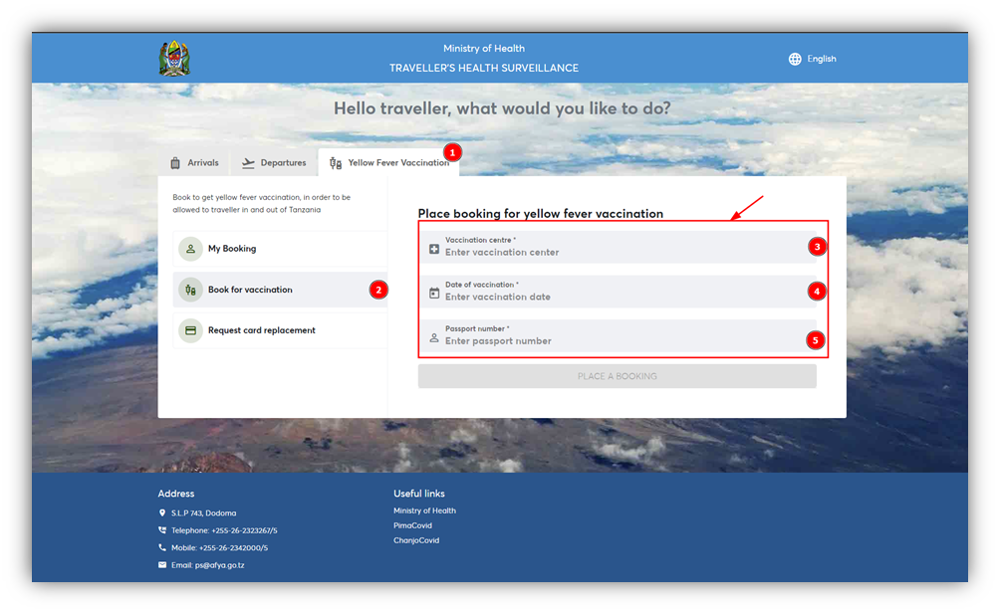
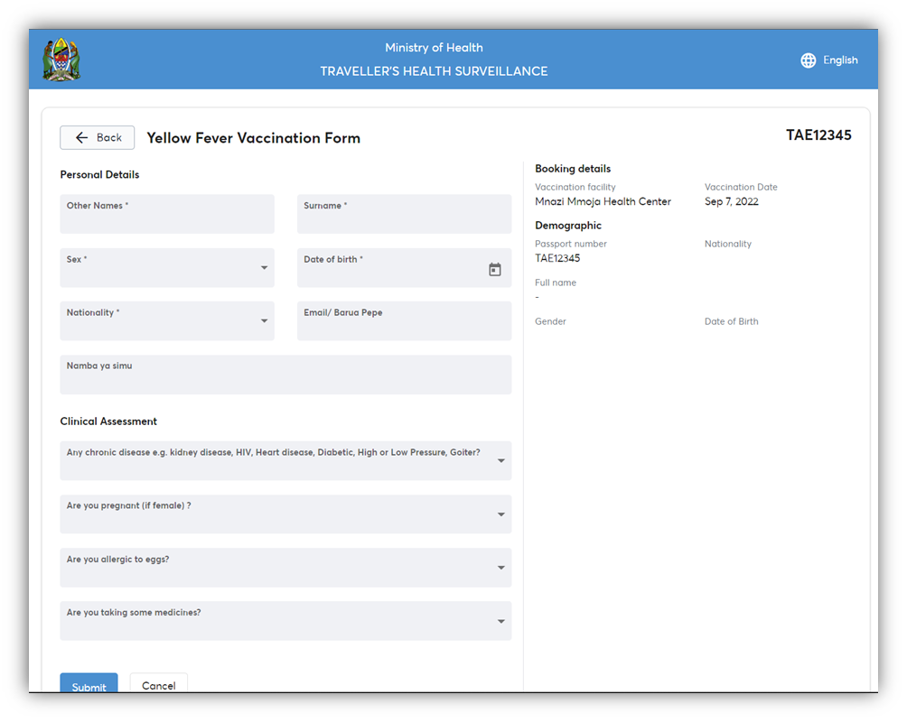
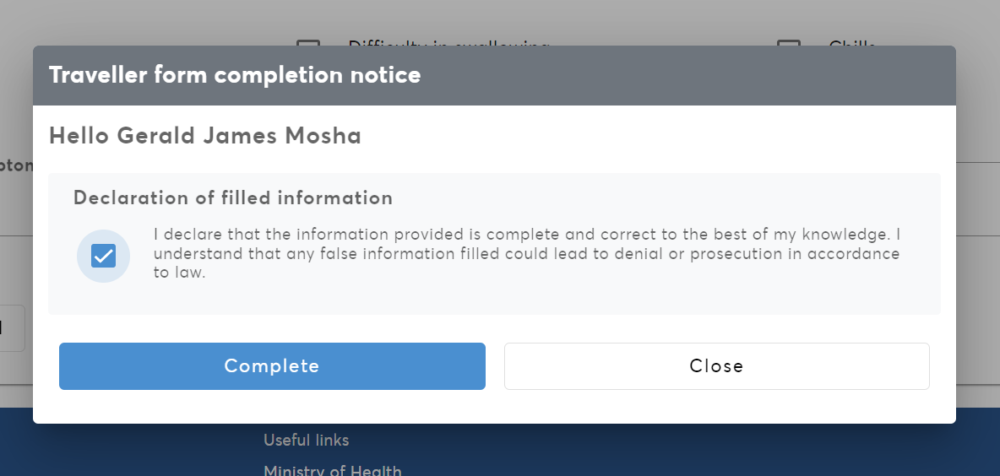

Travelers information should be completed on-line at [afyamsafiri.moh.go.tz](https://afyamsafiri.moh.go.tz/) based on travel advisory. The surveillance form should be completed by both international and domestic travelers. For international travelers, it should be completed at all times 24 hours before arrival. For domestic travelers, the surveillance form should be completed during public health emergencies, 24 hours before departure. The required information is provided in part 3.1 to 3.5 of this section.

**International Traveler:** Traveler entering or exiting the country. International travelers will be required to complete the e-surveillance system at all times of travel with reference to the travel advisory (TA).

**Domestic Traveler:** Traveler from one location within the country to another location (Region/District) within the country. Domestic travelers will be required to complete the e-surveillance system during public emergencies only.

### 3.1. Accessing the afyamsafiri application

1. Open a web browser.
2. Type the URL [https://afyamsafiri.moh.go.tz/](https://afyamsafiri.moh.go.tz/) on your browser address bar.
3. Select language.
4. Select the “arrival” option.
5. Select the required option (domestic arrival/ domestic departure/ international departure/ international arrival/ yellow fever vaccination).

*Figure 1:*

### 3.2. Filling Travelers Surveillance Arrival Form

Arrival form is filled by international travelers.

1. Open a web browser.
2. Type the URL [https://afyamsafiri.moh.go.tz/](https://afyamsafiri.moh.go.tz/) on your browser address bar.
3. Select language.
4. Select the “arrival” option.
5. Enter the passport number correctly in the text field then click “search passport” to open traveler’s surveillance form.
   - Fill all fields in personal information (other names, surname, date of birth, nationality, sex).
   - Fill arrival information including arrival date, point of entry, type of port, name and number of the conveyance, and seat number.
     Confirm seat number after boarding the conveyance.
     Name & number of conveyances should be the same as provided in the ticket.
   - Fill the purpose of visit in the country, occupation, and duration of stay.
   - Fill the contacts while in Tanzania (Physical address/hotel name, region, district, phone number, and email address).
   - Fill the country where the journey started.
   - Enter the number of other countries visited in the last 21 days (3 weeks).
   - Enter the name of the country, location, and date of visit.
   - Select sign/symptom(s) experienced in the last 21 days (3 weeks) before travel if any. When all the information has been completed accordingly, you can continue on finishing up filling the form. After completing the form, select the “submit button” to proceed or “cancel button” to cancel.

   Add screenshot of traveler surveillance arrival form.

6. Click “submit” to save information. If the “submit button” is not active – review the responses and ensure all the required fields marked with an asterisk sign (*) are completed.
7. Click the checkbox of the declaration statement and then click “complete” to save the information.
8. Click “close” on completion note. QR Code will appear to signal completion.
9. Click the National Emblem to go back to the home page.

   Add screenshot of travelers’ form completion notice and instruct “tick here”.3.3.	Filling Travelers Surveillance Departure Form
3.3.1.	Domestic Departure
Step 1	Open a web browser
Step 2	Type the Url (https://afyamsafiri.moh.go.tz/) on your browser address bar.
Step 3	Select language
Step 4	Select the “domestic departure” option
Step 5	Enter the passport/ID number correctly on the text field then click “search passport/ID” to open traveler’s surveillance form
	•	Fill all fields in on personal information (other names, surname, date of birth, and nationality sex).
	•	Fill all information including departure date, point of exit, type of port, name and number of the conveyance.
	•	Fill information on destination address: region, district ward and contact details both mobile phone number and email. 
	•	Fill in the physical address in Tanzania: region, district ward and contact details both mobile phone number and email.
	•	Fill in information on travel history
	•	Select sign/symptom(s) experienced in the last 21days (3 weeks) before travel if any. When all the information has been completed accordingly then you can continue on finishing up filling the form. After completing the form select the “submit button” to proceed or “cancel button” to cancel.

Add screen shot of traveller surveillance domestic departure form

Step 6	•	Click “submit” to save information 	If the “submit button” is not active – review the responses and ensure all the required fields marked with asterisk sign (*) are completed.
Step 7	•	Click the check box of the declaration statement and then click “complete” to save the information
Step 8	•	Click “close” on completion note	QR Code will appear to signal completion
Step 9:		•	Click the National Emblem to go back to the home page

Add screen shot of travelers’ form completion notice and instruct “tick here”

3.3.2.	International departure
Step 1	Open a web browser
Step 2	Type the Url (https://afyamsafiri.moh.go.tz/) on your browser address bar.
Step 3	Select language
Step 4	Select the “international departure” option
Step 5	Enter the passport number correctly on the text field then click “search passport/” to open traveler’s surveillance form
	•	Fill all fields in on personal information (other names, surname, date of birth, and nationality sex).
	•	Fill all information including departure date, point of exit, type of port, name and number of the conveyance.
	•	Fill information on destination address: region, district ward and contact details both mobile phone number and email. 
	•	Fill in the physical address in Tanzania: region, district ward and contact details both mobile phone number and email.
	•	Fill in information on travel history
	•	Select sign/symptom(s) experienced in the last 21days (3 weeks) before travel if any. When all the information has been completed accordingly then you can continue on finishing up filling the form. After completing the form select the “submit button” to proceed or “cancel button” to cancel.

Add screen shot of traveller surveillance domestic departure form

Step 6	•	Click “submit” to save information 	If the “submit button” is not active – review the responses and ensure all the required fields marked with asterisk sign (*) are completed.
Step 7	•	Click the check box of the declaration statement and then click “complete” to save the information
Step 8	•	Click “close” on completion note	QR Code will appear to signal completion
Step 9:		•	Click the National Emblem to go back to the home page

Add screen shot of travelers’ form completion notice and instruct “tick here”

3.4.	Booking for Yellow Fever Vaccination
Step 1	Open a web browser
Step 2	Type the Url (https://afyamsafiri.moh.go.tz/) on your browser address bar.
Step 3	Select language
Step 4	Select the “Yellow Fever Vaccination” service
Step 5	Select the vaccination center, date of vaccination and then provide a passport number and place a booking after which it will open a form for filling in your details.
Step 6	Fill in the Yellow Fever Vaccination form, which consists of two main sections i.e., Personal Details and Clinical Assessment as shown in Figure below. Once done filling in the form appropriately, place your booking by clicking the submit button and you will receive the notification via email about the vaccination.

Step 7	•	Click “submit” to save information 	If the “submit button” is not active – review the responses and ensure all the required fields marked with asterisk sign (*) are completed.
Step 8	•	Click the check box of the declaration statement and then click “complete” to save the information
Step 9	•	Click “close” on completion note	QR Code will appear to signal completion
Step 10:		•	Click the National Emblem to go back to the home page
NB: For emergency booking on a none vaccination day, you will be required to choose future dates as emergency vaccination by declaring emergency.
 

 Figure: Steps to book Yellow fever vaccination
 
 
Figure : Form for filling in details for yellow fever booking placing a book.

NB:	If the “submit button” is not active – review the responses and ensure all the required fields marked with asterisk sign (*) are completed.

3.4.1.	Declaration of filled information
After filling all the required information complete the declaration by clicking ( )  and then click “complete”. Filled details will be saved only when they see form completion notice
If you click “close” the information will be lost.

 
Figure 3.2.5: Screen shot of traveler’s form completion notice (add instruction tick here)
Screen shot: Form completion notice and information page (click here to edit)

3.5.	Request for card replacement
Step 1	Open a web browser
Step 2	Type the Url (https://afyamsafiri.moh.go.tz/) on your browser address bar.
Step 3	Select language
Step 4	Select the “card replacement” service
Step 5	Select the vaccination center, date of vaccination and then provide a passport number and place a booking after which it will open a form for filling in your details.
Step 6	Click Place a booking and Yellow Fever Card Replacement Form will be displayed.
Step 7	Fill in the Yellow Fever Vaccination form, which consists of two main sections i.e. Personal Details and Clinical Assessment as shown in Figure below. Once done filling in the form appropriately, place your booking by clicking the submit button and you will receive the notification via email about the vaccination.

 Figure: Steps to book Yellow fever vaccination
Step 8	•	Click “submit” to save information 	If the “submit button” is not active – review the responses and ensure all the required fields marked with asterisk sign (*) are completed.
Step 9	•	Click the check box of the declaration statement and then click “complete” to save the information
Step 10	•	Click “close” on completion note	QR Code will appear to signal completion
Step 11:		•	Click the National Emblem to go back to the home page

4.	 

5.	 Figure : Form for filling in details for yellow fever booking placing a book.

 
Figure 3.2.5: Screen shot of traveler’s form completion notice (add instruction tick here)
Screen shot: Form completion notice and information page (click here to edit)

Click the National Emblem (picha) to go back to the home page

Step 2:	

