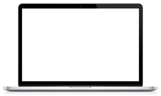
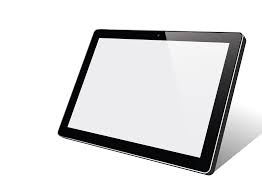
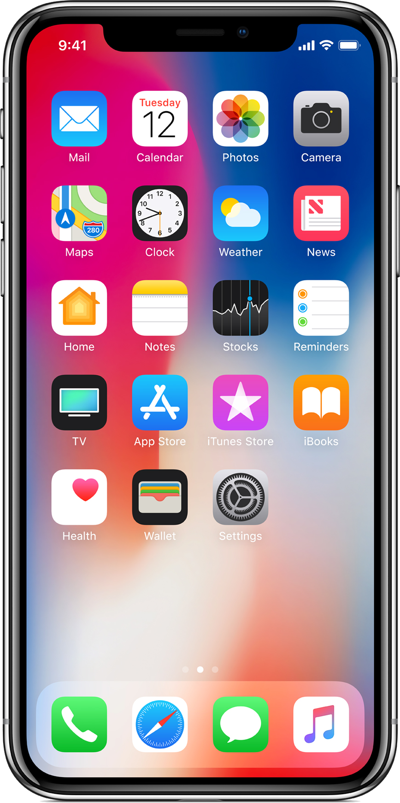

# 2.1. System Access Requirements

Afyamsafiri application can be accessed through a computing device such as a computer (laptop or desktop), tablet, or smartphone as long as it has a web browser. Figure 1 & 2 show a list of recommended devices and web browsers respectively. However, Google Chrome is more preferred.

Laptop
Tablet
Phone

*Figure 1: Example of computing devices that can be used to access Afyamsafiri*

Chrome
Firefox
Microsoft Edge

*Figure 2: Recommended web browsers that can be used to access Afyamsafiri*
